# Project Summary: PedIR RAG Backend

## Overview

PedIR RAG Backend is a production-ready, agentic Retrieval-Augmented Generation (RAG) system designed for a Pediatric Interventional Radiology chatbot at Hong Kong Children's Hospital (HKCH). It leverages **LangGraph** to orchestrate a sophisticated workflow involving emergency detection, hybrid retrieval, self-correction, and rigorous safety guardrails.

The system is designed to provide accurate, clinically safe, and parent-friendly information by retrieving data from a curated knowledge base of medical documents from trusted sources (HKCH, SickKids, CIRSE, SIR, HKSIR).

## Agent Architecture

The core of the system is a **LangGraph-based State Machine** that controls the flow of interaction. This allows for dynamic decision-making, error handling, and iterative quality improvement.

### Architecture Diagram

```mermaid
graph TD
    %% Nodes
    START((Start))
    END((End))
    
    %% Guardrails
    CheckEmergency[("🚨 Check Emergency<br>(Pattern Match)")]
    HandleEmergency["🚑 Handle Emergency<br>(Canned Response)"]
    
    %% Core Agent
    Orchestrator["🤖 Orchestrator<br>(LLM: Generate Query or Respond)"]
    
    %% Retrieval & Tools
    Retrieve{{"🛠️ Retrieve Tools<br>(Vector + SQL)"}}
    
    %% Evaluation & Correction
    GradeDocs["⚖️ Grade Documents<br>(LLM Evaluator)"]
    Rewrite["rewrite_question<br>(LLM Rewriter)"]
    
    %% Generation
    GenerateAnswer["📝 Generate Final Answer<br>(LLM Synthesizer)"]
    SafetyCheck[("🛡️ Safety Check<br>(LLM Guardrail)")]

    %% Data Stores
    VectorDB[("ChromaDB<br>(Vectors)")]
    DocDB[("SQLite<br>(Full Docs)")]

    %% Flow
    START --> CheckEmergency
    
    CheckEmergency -- "Emergency Detected" --> HandleEmergency
    CheckEmergency -- "Safe" --> Orchestrator
    
    HandleEmergency --> END
    
    Orchestrator -- "Direct Answer" --> GenerateAnswer
    Orchestrator -- "Call Tools" --> Retrieve
    
    Retrieve <--> VectorDB
    Retrieve <--> DocDB
    
    Retrieve --> GradeDocs
    
    GradeDocs -- "Relevant" --> GenerateAnswer
    GradeDocs -- "Not Relevant" --> Rewrite
    
    Rewrite -- "New Query" --> Orchestrator
    
    GenerateAnswer --> SafetyCheck
    SafetyCheck --> END

    %% Styling
    classDef urgent fill:#ffcccc,stroke:#ff0000,stroke-width:2px;
    classDef agent fill:#e1f5fe,stroke:#01579b,stroke-width:2px;
    classDef tool fill:#fff9c4,stroke:#fbc02d,stroke-width:2px;
    classDef store fill:#f3e5f5,stroke:#7b1fa2,stroke-width:2px;
    
    class CheckEmergency,HandleEmergency urgent;
    class Orchestrator,GradeDocs,Rewrite,GenerateAnswer,SafetyCheck agent;
    class Retrieve tool;
    class VectorDB,DocDB store;
```



### Agent Workflow Steps

1.  **Emergency Detection (`check_emergency`)**:
    *   **Logic**: deterministically checks user input against a list of critical keywords (e.g., "difficulty breathing", "bleeding", "faint").
    *   **Action**: If triggered, immediately routes to `handle_emergency` to provide a standard safety message and stop processing.

2.  **Orchestration (`generate_query_or_respond`)**:
    *   **Logic**: The "Brain" of the operation. It analyzes the user's non-emergency query and conversation history.
    *   **Decision**:
        *   **Retrieval Needed**: Calls appropriate tools (`search_kb`, `search_documents_sql`) to get information.
        *   **Direct Answer**: If the query is conversational (e.g., "Hello") or out of scope, it generates a direct response.

3.  **Retrieval (`retrieve`)**:
    *   **Execution**: Executes the tools selected by the orchestrator.
    *   **Hybrid Search**:
        *   **`search_kb`**: Semantic vector search using embeddings (ChromaDB) to find concepts.
        *   **`search_documents_sql`**: Metadata-based search (SQLite) for filtering by source, procedure type, etc.
        *   **`get_document_by_id`**: Fetches the complete text of a document for full context.

4.  **Document Grading (`grade_documents`)**:
    *   **Logic**: An LLM-based evaluator checks if the retrieved documents are actually relevant to the user's specific question.
    *   **Outcome**:
        *   **Pass**: Proceed to answer generation.
        *   **Fail**: If documents are irrelevant, route to `rewrite_question`.

5.  **Self-Correction (`rewrite_question`)**:
    *   **Logic**: Uses an LLM to rephrase the original question into a better search query, removing ambiguity or refining terms.
    *   **Loop**: Sends the new query back to the **Orchestrator** to try retrieval again (limited to 2 retries).

6.  **Answer Generation (`generate_answer`)**:
    *   **Logic**: Synthesizes the retrieved information into a clear, parent-friendly response.
    *   **Constraint**: Strictly grounded in the provided context (Grounding).
    *   **Format**: Uses structured output (Pydantic) to ensure consistent formatting.

7.  **Safety Guardrail (`SafetyCheck`)**:
    *   **Logic**: A final LLM pass to ensure the generated answer is safe, clinically appropriate, and contains necessary disclaimers.

## Key Components

### 1. Multi-Provider LLM Support
*   **OpenAI**: Standard choice for high quality (`gpt-4o`).
*   **Ollama**: Local privacy-focused inference (`medgemma`, `llama3`).
*   **LM Studio**: OpenAI-compatible local API for flexible model hosting.

### 2. Dual-Store Knowledge Base
*   **Vector Store (ChromaDB)**: Stores document chunks and embeddings for semantic similarity search. Useful for "fuzzy" questions.
*   **Document Store (SQLite)**: Stores **full** document text and structured metadata. Useful for retrieving the complete context of a procedure guide once found, prohibiting "lost in the middle" issues with chunking.

### 3. Source-Aware Processing
*   **Ingestion Pipeline**: Automatically classifies documents by:
    *   **Source Organization**: HKCH, SickKids, SIR, HKSIR, CIRSE.
    *   **Procedure Category**: Venous Access, Embolization, etc.
    *   **Region**: Distinguishes between local (Hong Kong) and international protocols.

### 4. Evaluation Framework
*   **RAGAS Metrics**: Automated testing for:
    *   **Faithfulness**: Is the answer derived *only* from context?
    *   **Answer Relevance**: Does it actually answer the question?
    *   **Context Precision**: Was the retrieval accurate?
*   **Comparison Script**: `compare_models.py` allows side-by-side benchmarking of different LLMs and embedding models.

## Current Status (Feb 2026)

### ✅ Completed
*   [x] Full Agentic RAG pipeline with LangGraph.
*   [x] Hybrid retrieval (Vector + SQL).
*   [x] Emergency detection middleware.
*   [x] Document ingestion with MarkItDown (supporting PDF, DOCX, HTML, etc.).
*   [x] Streamlit UI with streaming responses and progress tracking.
*   [x] Evaluation suite.

### 🚧 In Progress / Next Steps
*   [ ] **Clinical Validation**: Review of answers by the IR radiologists.
*   [ ] **Knowledge Base Expansion**: Adding more localized HKCH-specific protocols.
*   [ ] **Deployment**: Containerization (Docker) for hospital server deployment.
*   [ ] **User Feedback Loop**: Mechanism for users to rate answer helpfulness.

## Directory Structure Highlights

```
src/
├── agentic_rag.py       # Main LangGraph definitions (Nodes & Edges)
├── rag_pipeline.py      # Pipeline orchestration class
├── tools.py             # Vector search tools
├── sql_tools.py         # SQLite document tools
├── guardrails.py        # Safety & Emergency middleware
├── document_processor.py# Ingestion & Chunking logic
├── retriever.py         # Hybrid retrieval logic
└── llm.py               # LLM Provider abstractions
scripts/
├── ingest_documents.py  # ETL script
└── run_evaluation.py    # Testing script
```
